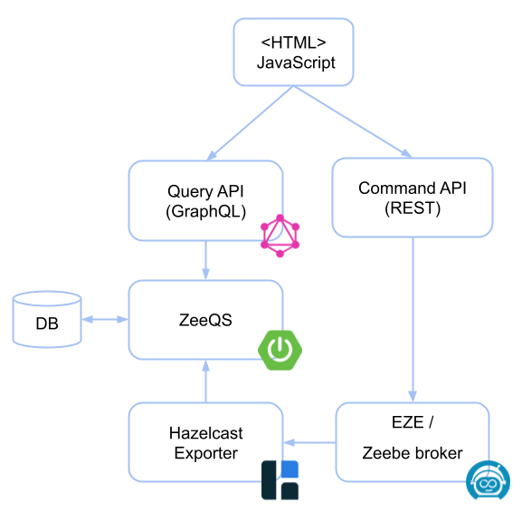

# Contributing to Zeebe Play

:tada: First off, thanks for taking the time to contribute! :+1:

## How can I contribute?

### Reporting bugs

If you found a bug or an unexpected behevior then please create
a [new issue](https://github.com/camunda-community-hub/zeebe-play/issues). Before creating an issue, make sure
that there is no issue yet. Any information you provide in the issue, helps to solve it.

### Suggesting enhancements

If you have an idea how to improve the project then please create
a [new issue](https://github.com/camunda-community-hub/zeebe-play/issues). Describe your idea and the
motivation behind it.

Please note that this is a community-driven project. The maintainers may have not much time to implement new features if
they don't benefit directly from it. So, think about providing a pull request.

### Providing a pull requests

You want to provide a bug fix or an improvement? Great! :tada:

Before opening a pull request, make sure that there is a related issue. The issue helps to confirm that the behavior is
unexpected, or the idea of the improvement is valid. (Following the rule "Talk, then code")

In order to verify that you don't break anything, you should build the whole project and run all tests. This also apply
the code formatting.

Please note that this is a community-driven project. The maintainers may have no time to review your pull request
immediately. Stay patient!

## Hints for developers

For development, ZeeQS's GraphQL API can be inspected by using http://localhost:8080/graphiql. 

### Architecture



### Contributing to the frontend

The frontend of Zeebe-Play is based on HTML and (plain) JavaScript. 

The following libraries are used:

- [Bootstrap](https://getbootstrap.com/)
- [Bootstrap icons](https://icons.getbootstrap.com/)
- [jQuery](https://jquery.com/)
- [Thymeleaf](https://www.thymeleaf.org/) (for splitting the HTML page/fragments)
- [bpmn-js](https://github.com/bpmn-io/bpmn-js) 
- [bpmn-font](https://github.com/bpmn-io/bpmn-font) 

Enhancing the user interface (UI) or the user experience (UX) are good areas for contributions. But also improvements of the JavaScript code are welcome. Since I don't have much experience in this area, it might look odd and not following best practices.  

### Contributing to the backend 

The backend of Zeebe-Play is written in [Kotlin](https://kotlinlang.org/) and based on the [Spring Boot](https://spring.io/projects/spring-boot/) framework.  

Currently, it contains only the REST command API and a few services. The other parts are included from libraries, like the following:

- [EZE](https://github.com/camunda-community-hub/eze), runs processes on an embedded Zeebe engine 
- [ZeeQS](https://github.com/camunda-community-hub/zeeqs), exposes Zeebe's data as a GraphQL API
- [Zeebe Hazelcast Exporter](https://github.com/camunda-community-hub/zeebe-hazelcast-exporter), transmits Zeebe's data via Hazelcast
- [Zeebe Exporter Protobuf](https://github.com/camunda-community-hub/zeebe-exporter-protobuf), serializes Zeebe's data to Protobuf

Contributions in the dependent libraries are very welcome and are directly useful for Zeebe-Play. 

## Building the project from source

You can build the project with [Maven](http://maven.apache.org).

In the root directory:

Run the tests with

```
mvn test
```

Build the JAR files with

```
mvn clean install
```

## Styleguides

### Formatting the source code

The Java code should be formatted using [Google's Java Format](https://github.com/google/google-java-format).

### Git commit messages

Commit messages should follow the [Conventional Commits](https://www.conventionalcommits.org/en/v1.0.0/#summary) format.

For example:

```
feat: show deployed processes

* query deployed processes from GraphQL
* render query result in process page
```

Available commit types:

* `feat` - enhancements, new features
* `fix` - bug fixes
* `refactor` - non-behavior changes
* `test` - only changes in tests
* `docs` - changes in the documentation, readme, etc.
* `style` - apply code styles
* `build` - changes to the build (e.g. to Maven's `pom.xml`)
* `ci` - changes to the CI (e.g. to GitHub related configs)
