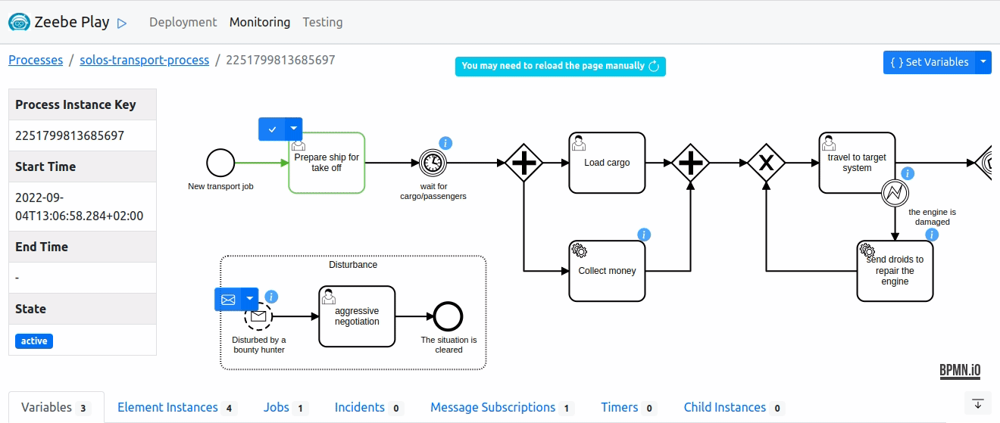

# zeebe-play

[](https://github.com/camunda-community-hub/community)
[](https://github.com/Camunda-Community-Hub/community/blob/main/extension-lifecycle.md#incubating-)
[](https://opensource.org/licenses/Apache-2.0)

[](https://github.com/camunda-community-hub/community/blob/main/extension-lifecycle.md#compatiblilty)

A web application for [Zeebe](https://camunda.com/platform/zeebe/) to play with processes. You could
describe it as a [token simulation](https://github.com/bpmn-io/bpmn-js-token-simulation) but for
executable processes (i.e. modeles enhanced with technical properties). It enables you to walk
through your process by completing tasks and triggering events, in an intuative way.

✨ You could use it to:

- explore how your process runs on Zeebe, the workflow engine of Camunda Platform 8
- check if your process with its technical properties behaves as expected
- replay a given scenario

---



---

### 🍪 Credits

Zeebe-Play is build on top of other great community projects, for example:

- [EZE](https://github.com/camunda-community-hub/eze), an embedded Zeebe engine to run the processes
- [ZeeQS](https://github.com/camunda-community-hub/zeeqs), a GraphQL API to import and aggregate
  Zeebe's data
- [Zeebe Hazelcast Exporter](https://github.com/camunda-community-hub/zeebe-hazelcast-exporter), an
  exporter based on Hazelcast to consume Zeebe's data

### 🔥 Disclaimer

This project is a **community-driven** extension and not officially supported by Camunda. It is **
not recommended** to be used in a production environment.

## :fuelpump: Install 

### Docker

The docker image is published
to [GitHub Packages](https://github.com/orgs/camunda-community-hub/packages/container/package/zeebe-play)
.

Pull the image using the following command:

```
docker pull ghcr.io/camunda-community-hub/zeebe-play:1.0.0
```

Next, have a look at [usage](#-usage) on how to start the docker container, and the different configurations.

### Docker Compose

For a local setup, the repository contains a [docker-compose file](docker/docker-compose.yml). It
contains multiple profiles for different configurations.

Embedded Zeebe engine and in-memory database:

```
docker-compose --profile in-memory up
```

Remote Zeebe engine and in-memory database:

```
docker-compose --profile remote-engine up
```

Embedded Zeebe engine and PostgreSQL database:

```
docker-compose --profile postgres up
```

After Zeebe-Play is started, go to http://localhost:8080 and play.

## 🚀 Usage

Zeebe-Play can be used in different configurations:

- with embedded or remote Zeebe engine (default: embedded)
- with in-memory or persistent database (default: in-memory)

See the following sections for detailed instructions.

After Zeebe-Play is started, go to http://localhost:8080 and play.

### Default

By default, Zeebe-Play runs the processes on an embedded Zeebe engine (EZE) and stores the data in
an in-memory database (H2). Since there is no persistence, Zeebe-Play starts always with a fresh
state (i.e. no data on restart).

Use the following command to start the docker container:

```
docker run -p 8080:8080 -p 26500:26500 ghcr.io/camunda-community-hub/zeebe-play:1.0.0
```

- expose port `8080` for the web application
- (optional) expose port `26500` for the Camunda modeler and Zeebe clients

Or, if you run it on your local machine:

```
docker run --network="host" ghcr.io/camunda-community-hub/zeebe-play:1.0.0
```

### Connecting to a remote Zeebe engine

Zeebe-Play can connect to a remote Zeebe engine to run the processes.

#### In the Zeebe broker

- configure
  the [Hazelcast exporter](https://github.com/camunda-community-hub/zeebe-hazelcast-exporter#manual)
- enable the clock endpoint to use the time travel function
    - `ZEEBE_CLOCK_CONTROLLED=true` (environment variable)
    - `zeebe.clock.controlled: true` (application.yaml)
- expose the ports
    - `26500` for connecting the Zeebe client
    - `5701` for connection to Hazelcast

For example, using the pre-built community Zeebe image with Hazelcast exporter:

```
docker run -p 26500:26500 -p 5701:5701 -e ZEEBE_CLOCK_CONTROLLED=true ghcr.io/camunda-community-hub/zeebe-with-hazelcast-exporter:8.0.5
```

Or, if you run it on your local machine:

```
docker run --network="host" -e ZEEBE_CLOCK_CONTROLLED=true ghcr.io/camunda-community-hub/zeebe-with-hazelcast-exporter:8.0.5
```

#### In Zeebe-Play

- set the Zeebe engine to `remote`:
    - `ZEEBE_ENGINE=remote` (environment variable)
    - `zeebe.engine: remote` (application.yaml)
- (optional) configure the Zeebe broker connection (default: `127.0.0.1:26500`)
    - `ZEEBE_CLIENT_BROKER_GATEWAYADDRESS` (environment variable)
    - `zeebe.client.broker.gatewayAddress` (application.yaml)
- (optional) configure the Zeebe clock API (default: `127.0.0.1:9600/actuator/clock`)
    - `ZEEBE_CLOCK_ENDPOINT` (environment variable)
    - `zeebe.clock.endpoint` (application.yaml)
- (optional) configure the Hazelcast connection (default: `localhost:5701`)
    - `ZEEBE_CLIENT_WORKER_HAZELCAST_CONNECTION` (environment variable)
    - `zeebe.client.worker.hazelcast.connection` (application.yaml)

```
docker run -p 8080:8080 -e ZEEBE_ENGINE=remote ghcr.io/camunda-community-hub/zeebe-play:1.0.0
```

Or, if you run it on your local machine:

```
docker run --network="host" -e ZEEBE_ENGINE=remote ghcr.io/camunda-community-hub/zeebe-play:1.0.0
```

### Enable persistence

Zeebe-Play can store data in a persistent database, like PostgreSQL. This option is only useful in
combination with a remote Zeebe engine because the embedded Engine doesn't persist its data. As a
result, Zeebe-Play would show data of processes and instances but Zeebe wouldn't know about these.

Configure the following properties in Zeebe-Play:

(environment variables)

```
SPRING_DATASOURCE_URL=jdbc:postgresql://127.0.0.1:5432/postgres
SPRING_DATASOURCE_USERNAME=postgres
SPRING_DATASOURCE_PASSWORD=zeebe
SPRING_DATASOURCE_DRIVERCLASSNAME=org.postgresql.Driver
SPRING_JPA_PROPERTIES_HIBERNATE_DIALECT=org.hibernate.dialect.PostgreSQLDialect
SPRING_JPA_HIBERNATE_DLL_AUTO=create
```

(application.yaml)

```
spring:
  datasource:
    url: jdbc:postgresql://127.0.0.1:5432/postgres
    username: postgres
    password: zeebe
    driverClassName: org.postgresql.Driver
  jpa:
    properties.hibernate.dialect: org.hibernate.dialect.PostgreSQLDialect
    hibernate.dll-auto=create
```

## 🏗️ Contributions

Contributions are welcome 🎉 Please have a look at the [Contribution Guide](./CONTRIBUTING.md).

## ❓ FAQ

### What is the difference to the bpmn-js token simulation?

The [bpmn-js token simulation](https://github.com/bpmn-io/bpmn-js-token-simulation) is a great tool
to learn BPMN. Since it doesn't run the process on Zeebe, the workflow engine of Camunda Platform 8,
it ignores some technical properties of the process, like expressions, message correlations, or
timers, or execute them differently.

The token simulation is especially handy when crafting the process. Zeebe-Play shows its value when
enhancing the technical properties of the process to execute it on Zeebe.

### What is the difference to the Zeebe Simple Monitor?

The [Zeebe Simple Monitor](https://github.com/camunda-community-hub/zeebe-simple-monitor) is similar
to Zeebe-Play but it focuses more on monitoring process instances.

The goal of Zeebe-Play is to walk through a single process instance in an intuative way to
understand how it is executed.

Additionally, Zeebe-Play has a different 
[architecture](https://github.com/camunda-community-hub/zeebe-play/blob/main/CONTRIBUTING.md#architecture)
to benefit from other community projects and to build a more responsive frontend. 

### Can I use it in production?

No. It is not recommended to use Zeebe Play in a production environment.

The application is not designed to handle big data, or to import the data reliable. And, it is too
easy to manipulate a process accidentally.

## 🛂 Code of Conduct

This project adheres to the Contributor Covenant [Code of
Conduct](/CODE_OF_CONDUCT.md). By participating, you are expected to uphold
this code. Read more about
the [Camunda Community Code of Conduct](https://camunda.com/events/code-conduct/) and how to report
unacceptable behavior.

## 📖 License

[Apache License, Version 2.0](/LICENSE) 
